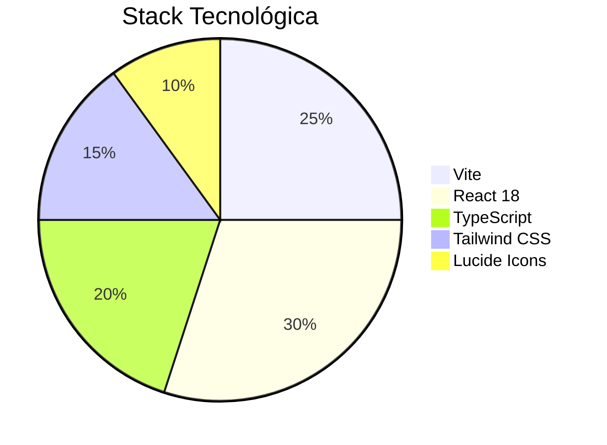

🎤 Roger UI | Plataforma de Terapia de Fala Interativa

<div align="center">
  
</div>


✨ Visão Geral
Plataforma lúdica para auxiliar fonoaudiólogos no tratamento de distúrbios de fala, com:
- **Jogos interativos** baseados em fonética
- **Monitoramento em tempo real** do progresso
- **Interface acessível** para crianças

🚀 Tecnologias-Chave


🎮 Funcionalidades
| Módulo         | Tecnologia Usada       | Benefício Terapêutico          |
|----------------|------------------------|--------------------------------|
| Jogo da Memória Sonora | Web Audio API | Discriminação auditiva         |
| Repetição de Fonemas   | MediaRecorder API | Articulação de sons            |
| Progresso Visual       | Chart.js         | Motivação do paciente          |

 📁 Estrutura do Projeto
```bash
src/
├── assets/          # Audios e imagens terapêuticas
├── components/      # Componentes reutilizáveis
│   ├── therapy/     # Jogos especializados
│   └── progress/    # Componentes de acompanhamento
├── hooks/           # useAudioAnalyzer, useSpeechDetection
├── providers/       # Contextos de terapia
├── styles/          # Configurações do Tailwind
└── types/           # Tipos específicos para fonoaudiologia
```

## 🛠️ Configuração Rápida
```bash
# 1. Clone o repositório
git clone https://github.com/Pedro-Rcastro/roger-ui.git

# 2. Instale as dependências
npm install

# 3. Inicie o servidor
npm run dev
```

🎨 Design System
```ts
// Cores terapêuticas (tailwind.config.js)
theme: {
  extend: {
    colors: {
      speech: {
        primary: '#5D5FEF',
        secondary: '#A5B4FC',
        accent: '#FCD34D'
      }
    }
  }
}
```

📈 Próximas Features
- [ ] Integração com API de reconhecimento de voz
- [ ] Modo multiplayer para terapia em grupo
- [ ] Exportação de relatórios em PDF

👨‍⚕️ Casos de Uso
```tsx
// Exemplo: Componente de Jogo Terapêutico
interface TherapyGameProps {
  difficulty: 'Sílaba' | 'Palavra' | 'Frase';
  targetSound: PhonemeType;
}

export const ArticulationGame = ({ difficulty }: TherapyGameProps) => {
  const { playSound } = useAudioFeedback();
  return <button onClick={playSound}>Repetir Som</button>;
}
```

🌐 Acessibilidade
- Navegação por teclado
- Contraste WCAG AA
- Legendas para todos os sons

<div align="center">
  <a href="https://roger-ui.vercel.app" target="_blank">
    
  </a>
</div>

----

**Desenvolvido com ❤️ por [Pedro Castro](https://github.com/Pedro-Rcastro)**  
[](https://www.linkedin.com/in/pedro-castro-)
```


